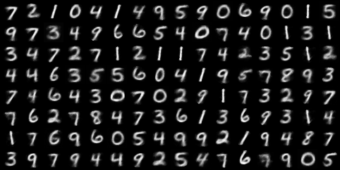

# CapsNet_pytorch
- Refer to [naturomics/CapsNet-Tensorflow](https://github.com/naturomics/CapsNet-Tensorflow)(Tensorflow) and [timomernick/pytorch-capsule](https://github.com/timomernick/pytorch-capsule)(Pytorch).  
- Implementation of [**Dynamic Routing Between Capsules**](https://arxiv.org/abs/1710.09829).  

## Statement
- Do the Experiments on the **MNIST** dataset.
- The accuracy and loss records can be find in **nohup.out**.
- The reconstruction img can be find in **result_img**.

## Append
- [CapsulesNet 的解析及整理](https://zhuanlan.zhihu.com/p/30970675)
- [Capsule Networks Explained](https://kndrck.co/posts/capsule_networks_explained/?nsukey=T%2FHdvRcjUBfihkYW23QZW0A8Q%2BljC4XZ9xJ0fVl2CVMEplz%2F1PwPluHYtS%2FUUxitMi%2BroERqd7kohaw8wXNUYmJUzpRpzSz6sud35oxMViGrNEpilQ7i3%2BPynLRiLYP6IEd7tmfNSkYGb%2F2vn4J4pnIht3tu6lihLD6vwQ7frfIQvDI8G3K0f1ILzbiFWx%2FV4%2BYufwFyWlyf9ypf7TDd1g%3D%3D)
- [Capsule Networks Are Shaking up AI — Here’s How to Use Them](https://hackernoon.com/capsule-networks-are-shaking-up-ai-heres-how-to-use-them-c233a0971952)

## Reconstruction Image

